<h1 align="center">Android Assessment</h1>

<h3 align="center">Install APK to Android device</h3>

After installing the APK on the Android device, the app will display a single screen featuring a button labeled 'CLICK ME.' Upon clicking this button, a Toast message with the text 'HELLO WORLD!' will appear.

<div align="center">
  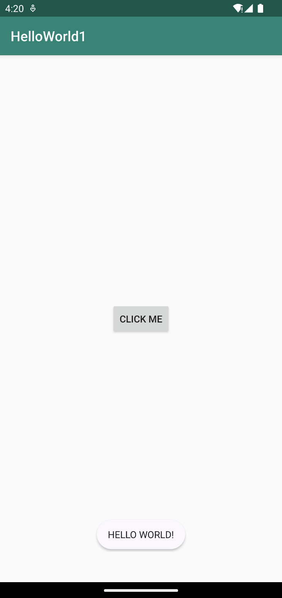
</div>

##

<h3 align="center">Analyse APK before starting the assessment</h3>

For further analysis, one can examine the certificate signed for the APK file using the following command provided by `apksigner`:

```
apksigner verify --print-certs apkFilePath
```

* `verify` flag validates the signature of the APK.
* `--print-certs` flag displays information about the APK's signing certificates.
* `apkFilePath` the path to the APK file.

<div align="center">
  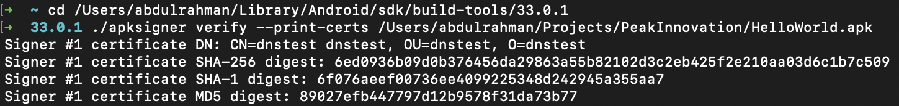
</div>

##

<h3 align="center">Decompile the HelloWorld.apk binary useing Apktool</h3>

I initiated the decompilation process by executing the following command provided by `apktool`:

```
apktool d apkFilePath
```

* `d` flag signifies 'decode'.
* `apkFilePath` the path to the APK file.

The attached screenshot depicting the result of this command in the terminal.
See screenshot 1 </p>

<div align="center">
  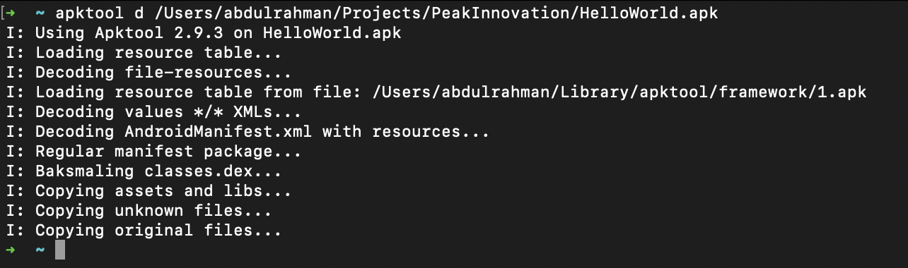
</div>

##

<h3 align="center">Contents of the AndroidManifest.xml file</h3>

After reviewing the AndroidManifest.xml file, several key details about the app become apparent. For instance, the compile SDK version is indicated as 29. Additionally, it's evident that the launcher activity is MainActivity, located within the com.dns.helloworld1 package.

<div align="center">
  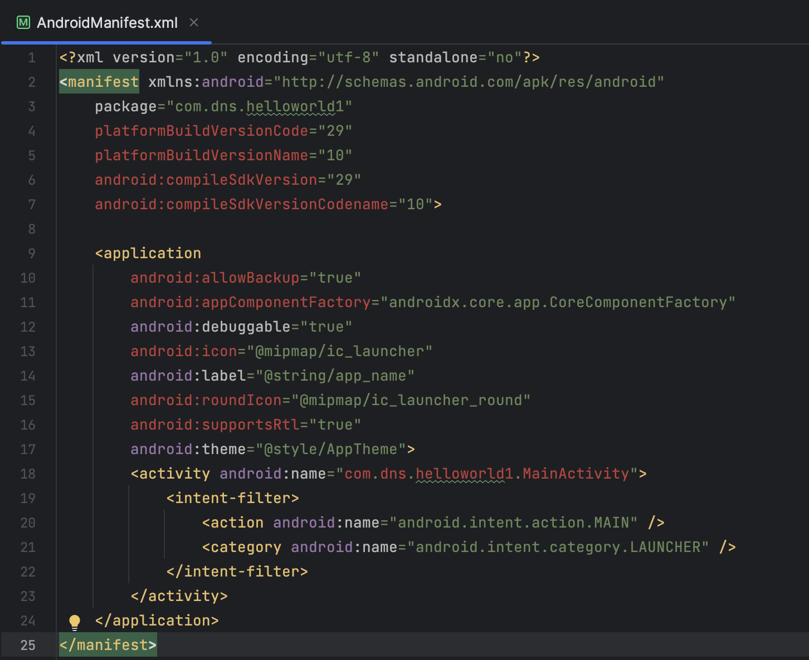
</div>

##

<h3 align="center">Contents of the smali files</h3>

After examining the contents of the smali files, it's evident that they lack readability. This outcome is expected, as the primary purpose of apktool is to enhance the human readability of decoded APK results.

<div align="center">
  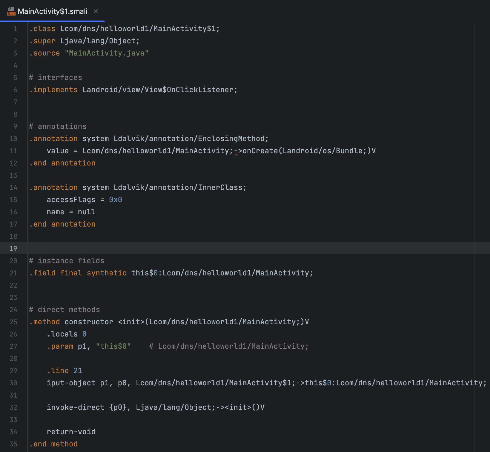
</div>

##

<h3 align="center">Replacing toast message</h3>

The screenshot below is annotated with four marks to highlight key elements. Mark number 1 identifies the onClick method, while mark 2 indicates the string utilized for the toast message display. Mark 3 illustrates the correct method, `Toast.makeText("text").show()`, being employed. Finally, mark 4 denotes the end of the method. These annotations clarify that this method is indeed the one we need to modify in order to change the toast message.

<div align="center">
  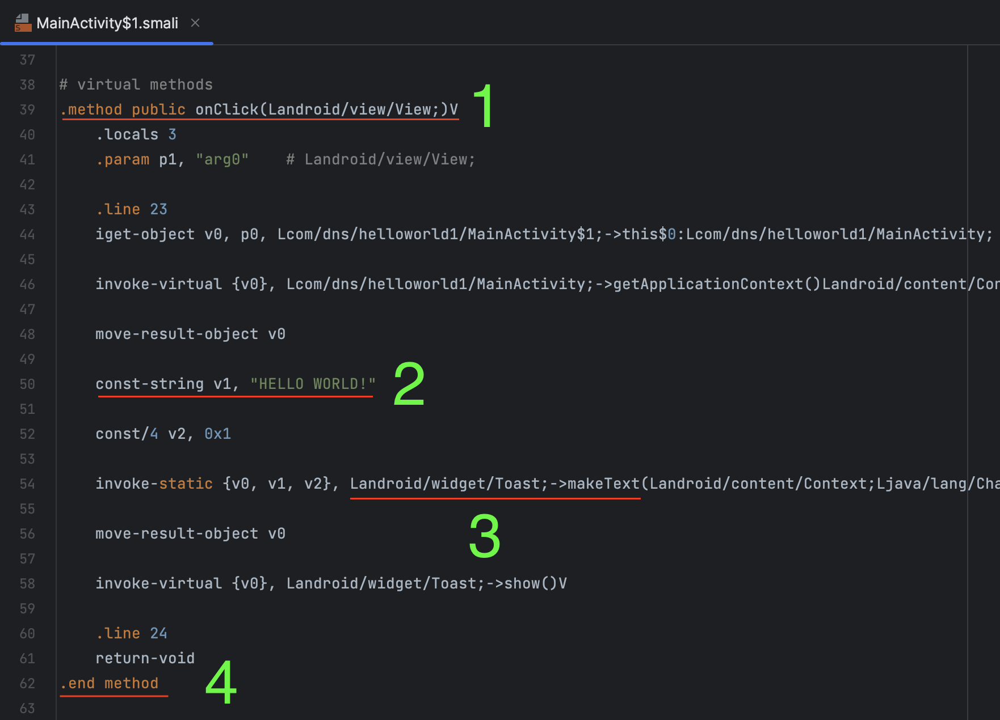
</div>

As per the requirement, I have successfully modified the message from 'HELLO WORLD!' to 'I GOT IT'.

<div align="center">
  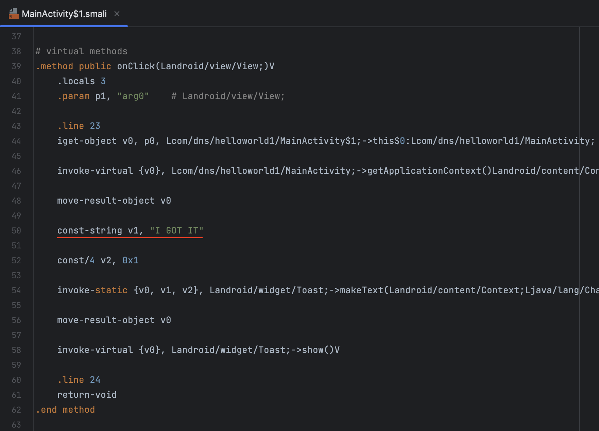
</div>

##

<h3 align="center">Compiling the modified APK using Apktool</h3>

To compile and build the project, we will utilize Apktool with the following command

```
apktool b projectFolderPath
```

* `b` flag signifies 'build'.
* `apkFilePath` the path to the project directory.

<div align="center">
  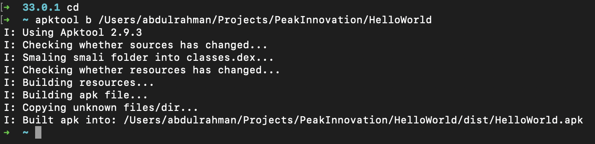
</div>

##

<h3 align="center">Signing the modified APK</h3>

If attempting to install the APK file on an Android device, it will fail due to lack of signing. To resolve this, we can sign the app using a KeyStore. The following command achieves this:

```
jarsigner -keystore keyStoreFilePath -storepass keyStorePassword apkFilePath keyStoreAlias
```

* `-keystore` flag specifies the path to the KeyStore
* `-storepass` flag provides the KeyStore password
* `apkFilePath` denotes the path to the unsigned APK file
* `keyStoreAlias` represents the Key Alias used in the KeyStore

<div align="center">
  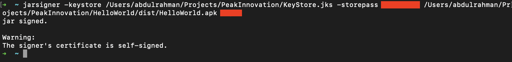
</div>

<br>
After installing the APK file, clicking on the button labeled 'CLICK ME' will trigger the appearance of a Toast message displaying the text 'I GOT IT'.
<br>
NOTE: The modified APK, named 'modifiedApp.apk', has been included in this repository

<br> <div align="center">
  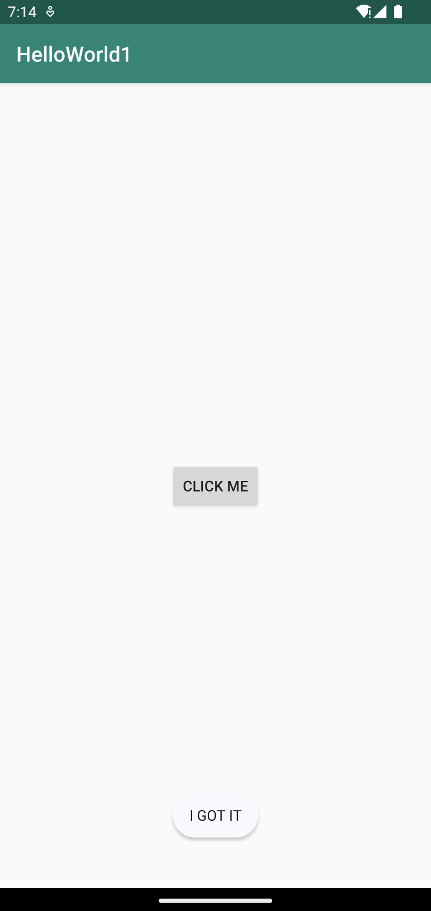
</div>

##

<h3 align="center">Viewing Java classes for the APK</h3>

For the bonus task, we utilized <a href="https://github.com/skylot/jadx?tab=readme-ov-file">JADX Tool</a>, a tool known for its GUI, to view the Java classes within the decoded APK. Attached is the screenshot depicting the MainActivity, as requested.

<div align="center">
  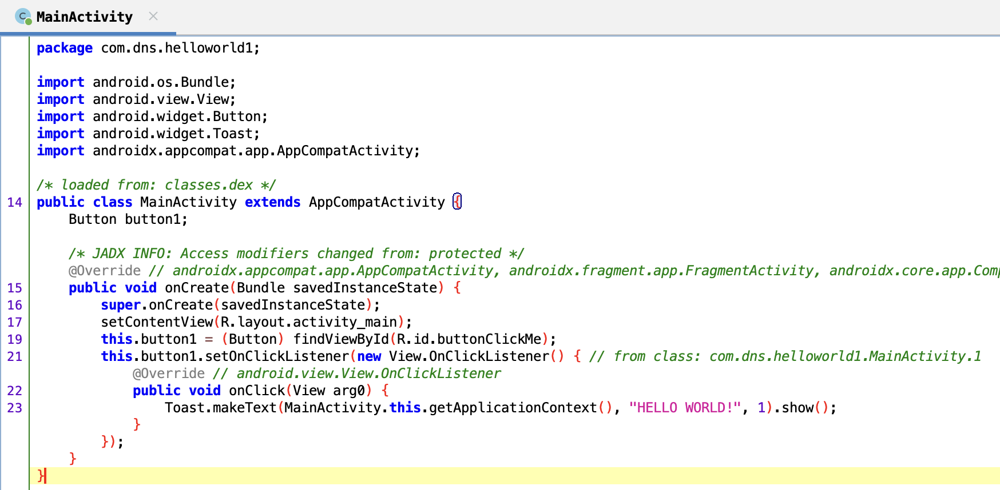
</div>
